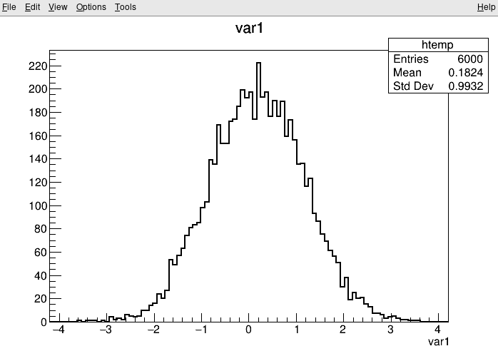

> This section shows you the difference between using ROOT with interactive C++, compiled C++ and Python.
{: .testimonial}

## Interactive C++

One of the main features of ROOT is the possibility to use C++ interactively thanks to the C++ interpreter [Cling](https://root.cern/cling/). Cling lets you use C++ just like Python either from the prompt or in scripts.

### The ROOT prompt

By just typing `root` in the terminal you will enter the ROOT prompt. Like the Python prompt, the ROOT prompt is well suited to fast investigations.

```bash
$ root
root [0] 1+1
(int) 2
```

If you pass a file as argument to `root`, the file will be opened when entering the prompt and put in the variable `_file0`. ROOT typically comes with support for reading files remotely via HTTP (and [XRootD](https://xrootd.slac.stanford.edu/)), which we will use for the following example:

> ## No support for remote files?
> Although unlikely, your ROOT build may not be configured to support remote file access. In this case, you can just download the file with `curl -O https://root.cern/files/tmva_class_example.root` and point to your local file. No other changes required!
{: .solution}

```bash
$ root https://root.cern/files/tmva_class_example.root

root [0]
Attaching file https://root.cern/files/tmva_class_example.root as _file0...
(TFile *) 0x555f82beca10

root [1] _file0->ls() // Show content of the file, all objects are accessible via the prompt!
TWebFile**              https://root.cern/files/tmva_class_example.root
 TWebFile*              https://root.cern/files/tmva_class_example.root
  KEY: TTree    TreeS;1 TreeS
  KEY: TTree    TreeB;1 TreeB

root [2] TreeS->GetEntries() // Number of events in the dataset

root [3] TreeS->Print() // Show dataset structure
******************************************************************************
*Tree    :TreeS     : TreeS                                                  *
*Entries :     6000 : Total =           98896 bytes  File  Size =      89768 *
*        :          : Tree compression factor =   1.00                       *
******************************************************************************
*Br    0 :var1      : var1/F                                                 *
*Entries :     6000 : Total  Size=      24641 bytes  One basket in memory    *
*Baskets :        0 : Basket Size=      32000 bytes  Compression=   1.00     *
*............................................................................*
*Br    1 :var2      : var2/F                                                 *
*Entries :     6000 : Total  Size=      24641 bytes  One basket in memory    *
*Baskets :        0 : Basket Size=      32000 bytes  Compression=   1.00     *
*............................................................................*
*Br    2 :var3      : var3/F                                                 *
*Entries :     6000 : Total  Size=      24641 bytes  One basket in memory    *
*Baskets :        0 : Basket Size=      32000 bytes  Compression=   1.00     *
*............................................................................*
*Br    3 :var4      : var4/F                                                 *
*Entries :     6000 : Total  Size=      24641 bytes  One basket in memory    *
*Baskets :        0 : Basket Size=      32000 bytes  Compression=   1.00     *
*............................................................................*

root [4] TreeS->Draw("var1") // Draw a histogram of the variable var1
```

<kbd>

</kbd>



### ROOT scripts

A unique feature of ROOT is the possibility to use C++ scripts, also called "ROOT macros". A ROOT script contains valid C++ code and uses as entrypoint a function with the same name as the script. Let's take as example the file `myScript.C` with the following content.

```cpp
void myScript() {
    auto file = TFile::Open("https://root.cern/files/tmva_class_example.root");
    for (auto key : *file->GetListOfKeys()) {
        const auto name = key->GetName();
        const auto entries = file->Get<TTree>(name)->GetEntries();
        std::cout << name << " : " << entries << std::endl;
    }
}
```

Scripts can be processed by passing them as argument to the `root` executable:

```bash
$ root myScript.C

root [0]
Processing myScript.C...
TreeS : 6000
TreeB : 6000
```

The advantage of such scripts is the simple interaction with C++ libraries (such as ROOT) and running your code at C++ speed with the convenience of a script.

## Compiled C++

You can improve the runtime of your programs if you compile them upfront. Therefore, ROOT tries to make the compilation of ROOT macros as convenient as possible!

### ACLiC

ROOT provides a mechanism called ACLiC to compile the script in a shared library and call the compiled code from interactive C++, all automatically!

The only change required to our script is that we need to include all required headers:

```cpp
#include "TFile.h"
#include "TTree.h"
#include <iostream>

void myScript() {
    // The body of the myScript function goes here
}
```

Now, let's compile and run the script again. Note the `+` after the script name!

```bash
$ root myScript.C+

root [0]
Processing myScript.C+...
Info in <TUnixSystem::ACLiC>: creating shared library /path/to/myScript_C.so
TreeS : 6000
TreeB : 6000
```

ACLiC has many more features, for example compiling your program with debug symbols using `+g`. You can find the documentation [here](https://root.cern/manual/first_steps_with_root/#compiling-a-root-macro-with-aclic).

### C++ compilers

Of course, the C++ code can also just be compiled with C++ compilers such as `g++` or `clang++` with the advantage that you have full control of all compiler settings, most notable the optimization flags such as `-O3`!

To do so, we have to add the `main` function to the script, which is the default entrypoint for C(++) programs.

```cpp
#include "TFile.h"
#include "TTree.h"
#include <iostream>

void myScript() {
    // The body of the myScript function goes here
}

int main() {
    myScript();
    return 0;
}
```

Now, you can use the following command with your C++ compiler of choice to compile the script into an executable.

```bash
$ g++ -O3 -o myScript myScript.C $(root-config --cflags --libs)
$ ./myScript
TreeS : 6000
TreeB : 6000
```

Computationally heavy programs and long running analyses may benefit greatly from the optimized compilation with `-O3` and can save you hours of computing time!

## Python

ROOT provides the Python bindings called PyROOT. PyROOT is not just ROOT from Python, but a full-featured interface to call C++ libraries in a pythonic way. This lets you import the ROOT module from Python and makes all features dynamically available. Let's rewrite the C++ example from above and put the code in the file `myScript.py`!

```python
import ROOT

rfile = ROOT.TFile.Open('https://root.cern/files/tmva_class_example.root')
for key in rfile.GetListOfKeys():
    name = key.GetName()
    entries = rfile.Get(name).GetEntries()
    print('{} : {}'.format(name, entries))
```

Calling the Python script works as expected:

```bash
$ python myScript.py
TreeS : 6000
TreeB : 6000
```

But PyROOT can do much more for you than simply providing access to C++ libraries from Python. You can also inject efficient C++ code into your Python program to speed up potentially slow parts of your program!

```python
import ROOT

ROOT.gInterpreter.Declare('''
int my_heavy_computation(std::string x) {
    // heavy computation goes here
    return x.length();
}
''')

# Functions and object made available via the interpreter are accessible from
# the ROOT module
y = ROOT.my_heavy_computation("the ultimate answer to life and everything")
print(y) # Guess the result!
```

A guide to such advanced features of PyROOT can be found in the official manual at [https://root.cern/manual/python/](https://root.cern/manual/python/). Feel free to investigate!

> ## Try using ROOT with interactive C++, compiled C++ and Python!
> Make yourself familiar with the different ways you can run an analysis with ROOT!
{: .challenge}
