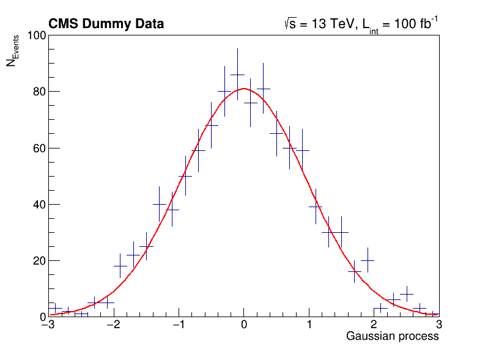

> This section is dedicated to the introduction to selected features of ROOT, which we see commonly used in typical day-to-day work and analyses.
{: .testimonial}

## Basic histogramming, fitting and plotting

The following script uses basic features from ROOT, which are used commonly in day-to-day work with ROOT. You can investigate the typical workflow to create histograms with `TH1F`, fit a function to the data with `TF1` and produce an accurate visualization with `TCanvas` and others. Below, you can see the output of the fit to the data with the measured parameters.

```python
import ROOT
import numpy as np

# Make global style changes
ROOT.gStyle.SetOptStat(0) # Disable the statistics box
ROOT.gStyle.SetTextFont(42)

# Create a canvas
c = ROOT.TCanvas('c', 'my canvas', 800, 600)

# Create a histogram with some dummy data and draw it
data = np.random.randn(1000).astype(np.float32)
h = ROOT.TH1F('h', ';Gaussian process; N_{Events}', 30, -3, 3)
for x in data: h.Fill(x)
h.Draw('E')

# Fit a Gaussian function to the data
f = ROOT.TF1('f', '[0] * exp(-0.5 * ((x - [1]) / [2])**2)')
f.SetParameters(100, 0, 1)
h.Fit(f)

# Let's add some CMS style headline
label = ROOT.TLatex()
label.SetNDC(True)
label.SetTextSize(0.040)
label.DrawLatex(0.10, 0.92, '#bf{CMS Dummy Data}')
label.DrawLatex(0.58, 0.92, '#sqrt{s} = 13 TeV, L_{int} = 100 fb^{-1}')

# Save as png file and show interactively
c.SaveAs('dummy_data.png')
c.Draw()
```

```
 FCN=30.2937 FROM MIGRAD    STATUS=CONVERGED      67 CALLS          68 TOTAL
                     EDM=1.34686e-08    STRATEGY= 1      ERROR MATRIX ACCURATE
  EXT PARAMETER                                   STEP         FIRST
  NO.   NAME      VALUE            ERROR          SIZE      DERIVATIVE
   1  p0           8.09397e+01   3.19887e+00   7.10307e-03  -3.40988e-05
   2  p1          -3.46483e-03   3.10501e-02   8.47265e-05  -2.30742e-03
   3  p2           9.56532e-01   2.24141e-02   4.97399e-05   2.58872e-03
Info in <TCanvas::Print>: file dummy_data.png has been created
```

> ## Try it by yourself!
> Run the code example by yourself! Remember that you can prevent the Python interpreter to shut down with `python -i your_script.py`.
{: .challenge}



## Investigating data in ROOT files

You have already seen the usage of `TTree::Draw` in the previous episode. Such quick investigations of data in ROOT files are typical usecases, which most analysts do on a daily basis. In the following you can learn about different ways to approach this task!

### Manually plotting with `TTree::Draw`

For quick studies on the raw data in a `TTree` on the command line, you can use `TTree::Draw` to make simple visualizations:

```bash
$ root https://root.cern/files/tmva_class_example.root

root [0]
Attaching file https://root.cern/files/tmva_class_example.root as _file0...
(TFile *) 0x558d7b54aa50
root [1] TreeS->Draw("var1") // just draw var1
Info in <TCanvas::MakeDefCanvas>:  created default TCanvas with name c1
root [2] TreeS->Draw("var1", "var2 > var1", "SAME") // draw var1 with the selection var2 > var1
(long long) 3222
```

<kbd>

</kbd>

### The `TBrowser`

More convenient is using ROOT's tool for browsing ROOT files, the `TBrowser`. You can spawn the GUI directly from the ROOT prompt as shown below.

```bash
$ root https://root.cern/files/tmva_class_example.root

root [0]
Attaching file https://root.cern/files/tmva_class_example.root as _file0...
(TFile *) 0x557892a0ef10
root [1] new TBrowser
(TBrowser *) 0x5578938de800
```

### The `rootbrowse` executable

For convenience, ROOT provides the executable `rootbrowse`, which let you open a `TBrowser` directly from the command line and attachs the files given as arguments!

```bash
rootbrowse https://root.cern/files/tmva_class_example.root
```

<kbd>

</kbd>

```bash
$ rootls https://root.cern/files/tmva_class_example.root
TreeB  TreeS
```

```bash
$ rootls -l https://root.cern/files/tmva_class_example.root
TTree  Jan 19 14:25 2009 TreeB  "TreeB"
TTree  Jan 19 14:25 2009 TreeS  "TreeS"
```

```bash
$ rootls -t https://root.cern/files/tmva_class_example.root
TTree  Jan 19 14:25 2009 TreeB  "TreeB"
  var1    "var1/F"    0
  var2    "var2/F"    0
  var3    "var3/F"    0
  var4    "var4/F"    0
  weight  "weight/F"  0
  Cluster INCLUSIVE ranges:
   - # 0: [0, 5998]
   - # 1: [5999, 5999]
  The total number of clusters is 2
TTree  Jan 19 14:25 2009 TreeS  "TreeS"
  var1  "var1/F"  0
  var2  "var2/F"  0
  var3  "var3/F"  0
  var4  "var4/F"  0
  Cluster INCLUSIVE ranges:
   - # 0: [0, 5998]
   - # 1: [5999, 5999]
  The total number of clusters is 2
```

### Other ROOT executables

There are many small helpers shipped with ROOT, which let you operate on data quickly from the command line and solve typical day-to-day tasks with ROOT files.

**List of ROOT executables**
- `rootbrowse`: Open a ROOT file and a TBrowser
- `rootls`: List file content, tree branches, objects’ stats
- `rootcp`: Copy objects within a file or between files
- `rootdrawtree`: Simple analyses from the command line
- `rooteventselector`: Select branches, events, compression algorithms and extract slimmer trees
- `rootmkdir`: Creates a directory in a TFile
- `rootmv`: Move objects between files
- `rootprint`: Print objects in plots on files
- `rootrm`: Remove objects from files

> ## Try it by yourself!
> Feel free to investigate the presented tools!
{: .challenge}

## Interoperability with NumPy arrays

- Link to https://root.cern/doc/master/df026__AsNumpyArrays_8py.html

There are many reasons, for example machine learning, that you probably want to export you rdata in Python to NumPy arrays. This is easily possible with ROOT and is part of RDataFrame. The code snipplets below show you how to do this conversion and how to move the data to typical tools in the Python ecosystem, e.g., `numpy` and `pandas`.

> ## numpy and pandas
> Have you installed `numpy` and `pandas` or are you on a system, which have them available? Normally, you can just run `pip install --user numpy pandas` to install missing packages! Another option is searching in your system package manager, they are typically available on all platforms.
{: .callout}

### Convert data in ROOT files to numpy arrays

The conversion feature is attached to the class RDataFrame. We will not introduce you here to this way to process data with ROOT because the following episode is dedicated to RDataFrame. For now, just keep in mind that you call `AsNumpy`! The data is returned as an dictionary of one-dimensional numpy arrays because each column can have a different data type.

```python
# Read out the data as a dictionary of numpy arrays
import ROOT
df = ROOT.RDataFrame('TreeS', 'https://root.cern/files/tmva_class_example.root')
columns = ['var1', 'var2', 'var3', 'var4']
data = df.AsNumpy(columns)
print('var1: {}'.format(data['var1']))
```

```
var1: [-1.1436108   2.1434433  -0.44391322 ...  0.37746507 -2.072639 -0.09141494]
```

### Move the data to numpy or pandas

The data can be passed naturally to any method in the Python ecosystem, which processes numpy arrays. Below is an example, which computes the mean of each column.

```python
# Apply numpy methods
import numpy as np
print('Means: {}'.format([np.mean(data[c]).item() for c in columns]))
```

```
Means: [0.18244409561157227, 0.28425973653793335, 0.3789360225200653, 0.7712161540985107]
```

Another interesting usecase is moving the dataset directly to a pandas dataframe. You can use the output of `AsNumpy` as input for the constructor and the data is directly available.

```python
# Convert to a pandas dataframe
import pandas
pdf = pandas.DataFrame(data)
print(pdf)
```

```
          var1      var2      var3      var4
0    -1.143611 -0.822373 -0.495426 -0.629427
1     2.143443 -0.018923  0.267030  1.267493
2    -0.443913  0.486827  0.139535  0.611483
3     0.281100 -0.347094 -0.240525  0.347208
4     0.604006  0.151232  0.964091  1.227711
...        ...       ...       ...       ...
5995 -0.040650 -0.154212 -0.097715  0.440331
5996  0.099931 -1.183759  0.034616  0.644502
5997  0.377465 -0.030945  1.166082  0.728614
5998 -2.072639 -0.635586 -0.747371 -1.285679
5999 -0.091415  0.221271  0.569032  1.386130

[6000 rows x 4 columns]
```

> ## Try it by yourself!
> The statements are very short, you can just copy paste them into the Python prompt. Feel free to investigate what you can do with `AsNumpy`! Further information can be found [here](https://root.cern/doc/master/df026__AsNumpyArrays_8py.html).
{: .challenge}

## ROOT in Jupyter notebooks

ROOT provides a deep integration with Jupyter notebooks. You can start a Jupyter notebook server including ROOT features with the following command:

```bash
root --notebook
```

Alternatively, you can go to [https://swan.cern.ch](https://swan.cern.ch), which provides this service for you. Note that you may have to visit [https://cernbox.cern.ch/](https://cernbox.cern.ch/) first at least once with your user account to create your CERNBox space!

### Python kernel

The typical use case of Jupyter is together with the Python kernel. You will see something similar to the screenshot below and you can work interactively with Python in the browser!

<kbd>

</kbd>

### C++ kernel

ROOT provides the same than the Python kernel but for C++! Similar to the ROOT prompt, you can work interactively with C++ in the notebook. Just select the C++ kernel in the dropdown menu!

<kbd>

</kbd>

### JSROOT

Another feature of ROOT is the `%jsroot on` magic, which enables ROOT for JavaScript! This allows you to interact with the visualization such as you are used to it from the interactive graphics in the Python prompt.

Because it's JavaScript, we can also embed these plots easily in any website! You can find the plot from the top of this episode as an interactive graphic below.

<kbd>

</kbd>

<script src="https://root.cern/js/5.8.1/scripts/JSRootCore.min.js" type="text/javascript"></script>
<script type='text/javascript'>
 var filename = "../fig/gauss.root";
 JSROOT.OpenFile(filename, function(file) {
    file.ReadObject("c;1", function(obj) {
       JSROOT.draw("drawing", obj, "");
    });
 });
</script>
<div id="drawing" style="width: 800px; height:600px"></div>

> ## Try it by yourself!
> Either run Jupyter locally via `root --notebook` or go to [https://swan.cern.ch](https://swan.cern.ch) to try ROOT in a Jupyter notebook!
{: .challenge}


