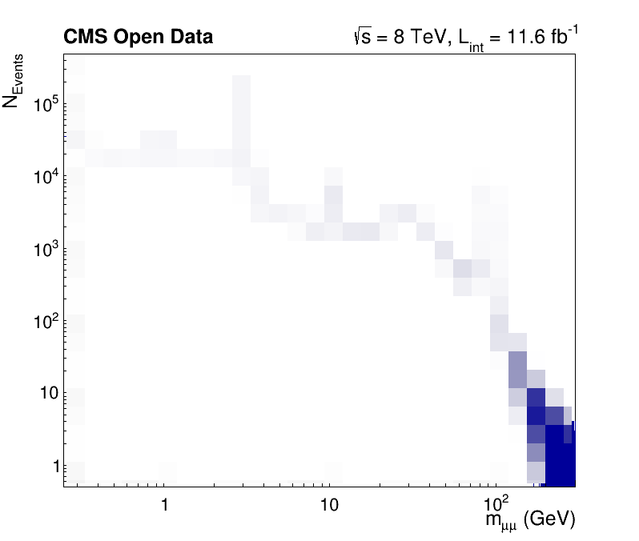

> ## Introduction to RDataFrame
> In this section, you will learn about the recommended tool to perform efficient analysis with ROOT called `RDataFrame`! `RDataFrame` enables you to run all your tasks efficiently in one go and on multiple threads.
{: .testimonial}

> ## Download the dataset
> Most likely, you will run multiple times over the used dataset with a size of 2.1 GB. To speed up the process, please download the file upfront. Either go to [http://opendata.web.cern.ch/record/12341](http://opendata.web.cern.ch/record/12341) and click the download button at the bottom or use the command below.
>
> ```bash
> xrdcp root://eospublic.cern.ch//eos/opendata/cms/derived-data/AOD2NanoAODOutreachTool/Run2012BC_DoubleMuParked_Muons.root .
> ```
{: .prereq}

## Implicit multi-threading in ROOT

ROOT tries to make parallelization as simple as possible for you. For this reason, we offer the feature `ROOT.EnableImplicitMT(N)`, which enables thread safety for the relevant classes and runs parallelized parts of ROOT, such as RDataFrame, implicitely on `N` threads:

```python
import ROOT

# Enable multi-threading with an auto-detected amount of threads
ROOT.EnableImplicitMT()

# Enamble multi-threading with the specified amount of threads
ROOT.EnableImplicitMT(4)
```

## RDataFrame constructor and Filter transformations

A possible way to construct an RDataFrame is passing one (ore more) filepaths and the name of the dataset (i.e. the name of the `TTree` object in the file, which is called `Events` in this section).

Next, you can apply selections and other transormations to the dataframe. The first basic transformation is applying cuts with the `Filter` method. Note that each transformation returns a new, transformed dataframe and does not change the dataframe object itself!

```python
# Create dataframe from a (reduced) NanoAOD file
df = ROOT.RDataFrame("Events", "Run2012BC_DoubleMuParked_Muons.root")

# For simplicity, select only events with exactly two muons and require opposite charge
df_2mu = df.Filter("nMuon == 2", "Events with exactly two muons")
df_os = df_2mu.Filter("Muon_charge[0] != Muon_charge[1]", "Muons with opposite charge")
```

## Injection of C++ code and Define transformations

The next code block uses PyROOT to inject a C++ implementation of the invariant mass computation. The name of the just-in-time compiled function can be used in the Define method to add a new column to the dataset, which will contain the dimuon mass.

```python
# Compute invariant mass of the dimuon system

# Perform the computation of the invariant mass in C++
ROOT.gInterpreter.Declare('''
using Vec_t = const ROOT::RVec<float>&;
float ComputeInvariantMass(Vec_t pt, Vec_t eta, Vec_t phi, Vec_t mass) {
    const ROOT::Math::PtEtaPhiMVector p1(pt[0], eta[0], phi[0], mass[0]);
    const ROOT::Math::PtEtaPhiMVector p2(pt[1], eta[1], phi[1], mass[1]);
    return (p1 + p2).M();
}
''')

# Add the result of the computation to the dataframe
df_mass = df_os.Define("Dimuon_mass", "ComputeInvariantMass(Muon_pt, Muon_eta, Muon_phi, Muon_mass)")
```

## Booking results

At any point, you can book the computation of results, e.g., histograms or a cut-flow report. Both of them are added below. Please note that RDataFrame is lazy! This means that the computation does not run right away, when you book a histogram, but you can accumulate multiple results and compute all of them in one go. The computation of all booked results is triggered only when you actually access one of the results!

```python
# Book histogram of the dimuon mass spectrum (does not actually run the computation!)
h = df_mass.Histo1D(("Dimuon_mass", ";m_{#mu#mu} (GeV);N_{Events}", 30000, 0.25, 300), "Dimuon_mass")

# Request a cut-flow report (also does not run the computation yet!)
report = df_mass.Report()
```

## Computing the result and making a plot

As explained above, accessing a dataframe result triggers the computation (sometimes called "event loop") of all results booked up to that point. Here, this happens when we access the axis of the histogram. However, you just have to remember to book all results first and then start working with the results so that they can all be computed in one go! At the end, we also print the cut-flow report to investigate the efficiency of the filters.

```python
# Produce plot
ROOT.gStyle.SetOptStat(0)
ROOT.gStyle.SetTextFont(42)
c = ROOT.TCanvas("c", "", 800, 700)
# The contents of one of the dataframe results are accessed for the first time here:
# this is when all results will actually be produced!
h.GetXaxis().SetTitleSize(0.04);
h.GetYaxis().SetTitleSize(0.04)
c.SetLogx(); c.SetLogy()
h.Draw()

label = ROOT.TLatex()
label.SetNDC(True)
label.SetTextSize(0.040)
label.DrawLatex(0.100, 0.920, "#bf{CMS Open Data}")
label.DrawLatex(0.550, 0.920, "#sqrt{s} = 8 TeV, L_{int} = 11.6 fb^{-1}")

# Save as png file
c.SaveAs("dimuon_spectrum.png")

# Print cut-flow report
report.Print()
```

```
Events with exactly two muons: pass=31104343   all=61540413   -- eff=50.54 % cumulative eff=50.54 %
Muons with opposite charge: pass=24067843   all=31104343   -- eff=77.38 % cumulative eff=39.11 %
```

Run the code by yourself to get a high-resolution dimuon spectrum, which shows resonances from 250 MeV to 300 GeV!



> ## Try it by yourself!
> - Assemble the code pieces and compute a high-resolution dimuon spectrum in under one minute!
> - Note that you have to keep the Python interpreter running to investigate the plot interactively. You can do this with `python -i your_script.py`
> - Does the computation time decrease with an increasing number of threads `N` in `ROOT.EnableImplicitMT(N)`?
> - Could you name the resonances?
{: .challenge}




