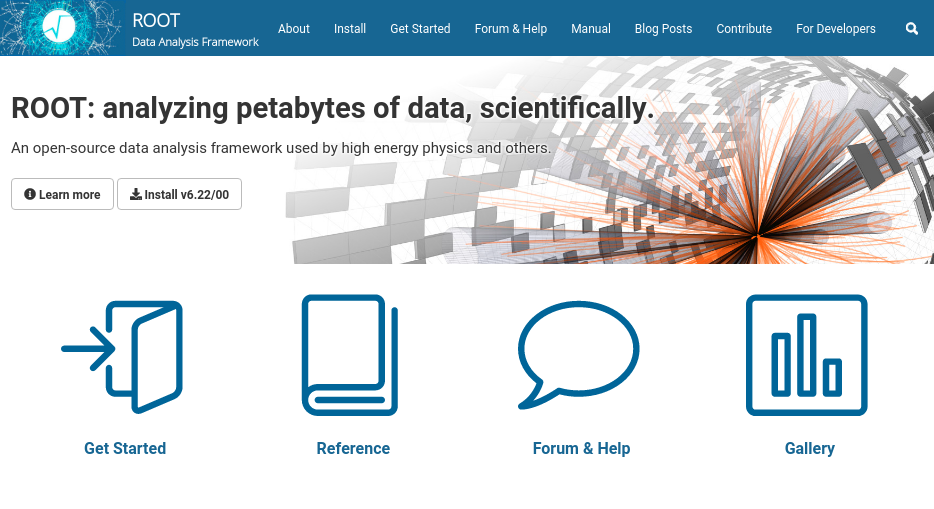
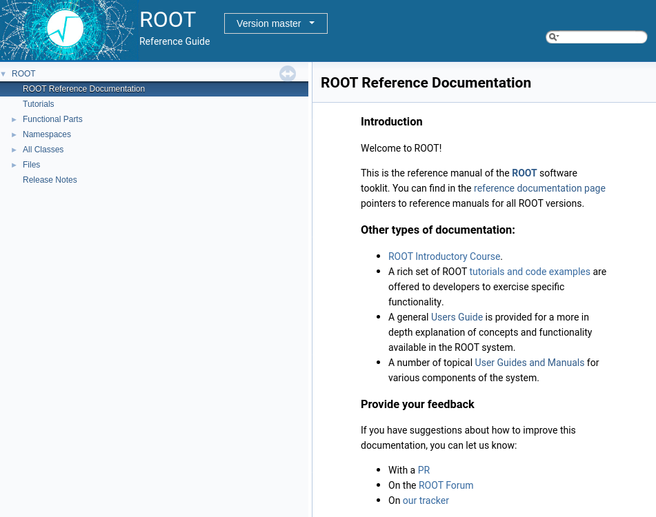
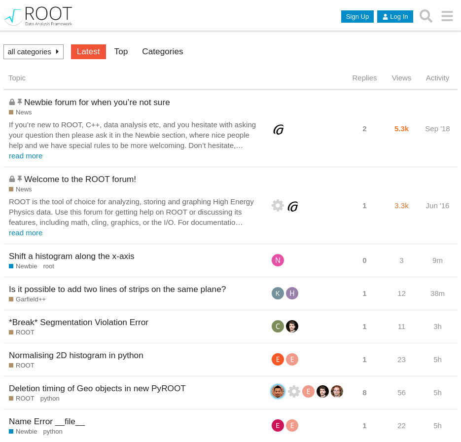

> ## Something does not work as expected, how can I get help?
> **User support is an integral part of ROOT and happily provided by the ROOT team!**
>
> We provide multiple communication channels so that we can help you but also you can help yourself to find the right answers to your questions, as fast as possible!
{: .discussion}

> ## Support and discussion channel for this lesson
> Communication channels for support and discussion dedicated to this lesson are linked on the [front page](/)!
{: .keypoints}

## The ROOT website, the beginner's guide and the manual

The [ROOT website](https://root.cern) is home to the [beginner's guide](https://root.cern/primer/) and the more in-depth [manual](https://root.cern/manual/). These are a great resource to start with ROOT and learn about parts of the framework in high detail. Keep in mind the ROOT website at [https://root.cern](https://root.cern), which provides links to all resources in a single place!

<kbd>

</kbd>

## The reference guide

The [reference guide](https://root.cern/doc/master/index.html) provides a more technical documentation about ROOT powered by [Doxygen](https://www.doxygen.nl/index.html). You can search for classes or functions in ROOT, learn about types and methods and trace features down to the actual implementation.

Although the reference guide is more technical in first place, important classes have extensive additional documentation. Feel free to investigate [TTree](https://root.cern/doc/master/classTTree.html) or [RDataFrame](https://root.cern/doc/master/classROOT_1_1RDataFrame.html)!

Another part of the reference guide are the [tutorials](https://root.cern/doc/master/group__Tutorials.html), which explain features in working code examples. Feel free to look at tutorials for [RooFit](https://root.cern/doc/master/group__tutorial__roofit.html) and [RDataFrame](https://root.cern/doc/master/group__tutorial__dataframe.html), which cover many typical use cases for these parts of ROOT!

<kbd>

</kbd>

## The ROOT forum

The [ROOT forum](https://root-forum.cern.ch/) is the to-go place if you cannot find the answer in the documentation. Don't hesitate to open a discussion, there is always someone from the ROOT team actively taking care of new questions in the forum!

But not only questions are very welcome, you can also discuss possible improvements or make suggestions for new features!

<kbd>

</kbd>

## Bug tracking

Bugs are currently tracked on [Jira](https://sft.its.cern.ch/jira/projects/ROOT/summary), but we will soon switch to [GitHub issues](https://github.com/root-project/root). However, if you discover bugs, please report them! In case you are not sure whether you see a bug or a feature, posting in the ROOT forum is always a good idea and always appreciated!


