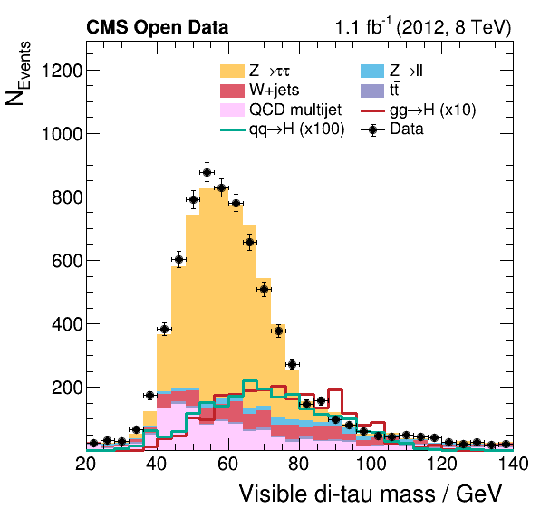

Finally, the histograms are combined to produce the final plots showing the data taken with the CMS detector compared with the expectation from the background estimates. These plots allow one to study the contribution of the different physics processes to the data taken with the CMS detector and represent the first step towards verifying the existence of the Higgs boson.

To combine the histograms produced in the previous step into meaningful plots, run the following command.

```bash
mkdir -p $HOME/awesome-workshop/plots
bash plot.sh $HOME/awesome-workshop/histograms/histograms.root $HOME/awesome-workshop/plots
```

The Python script generates for each variable a `png` and `pdf` image file, which can be viewed with a program of your choice. Two example outputs are shown below. Note that this analysis runs only over a fraction of the available data.

<div class="row">
  <div class="col-md-6">

    

  </div>
  <div class="col-md-6">

    

  </div>
</div>


