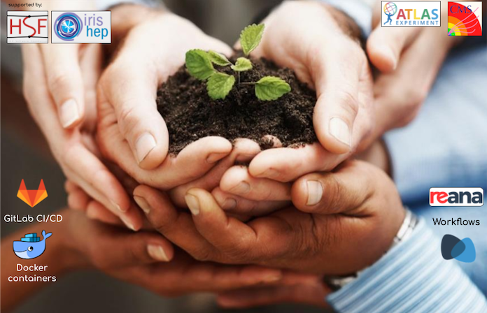

Example analysis of Higgs boson decays to two tau leptons used to teach software technologies at the Awesome Workshop aka the Analysis Preservation Bootcamp.

  

    

  

  

    

  

**Useful information**

Timetable: [Link to the Indico agenda](https://indico.cern.ch/event/854880/)

CERN Mattermost server: [mattermost.web.cern.ch](https://mattermost.web.cern.ch)

<b>f you find you are having issues, then don’t hesitate to ask. We have created a Mattermost channel for this purpose. Click on the invitation link below and start asking questions!</b>

**Invitation link for the Awesome Workshop team on Mattermost: [Click me!](https://mattermost.web.cern.ch/signup_user_complete/?id=t9zkdocffbbozqcdy193myre8y)**

Mattermost channel dedicated to prework discussions: [Prework Discussion](https://mattermost.web.cern.ch/awesome-ws/channels/prework-discussion)

<!-- this is an html comment -->


