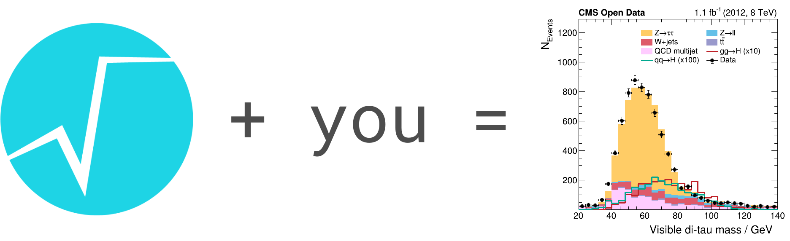

> ## Welcome to a lesson about efficient analysis with ROOT!
> Hi, here are Stefan and Enrico and you are about to learn how to perform efficient data analysis with ROOT!
>
> This lesson starts with a few sections providing more general information and an introduction to the very basics. The second part allows you to gain hands-on experience with modern analysis facilities using an example analysis based on NanoAOD files.
{: .callout}

> ## How does this work?
> - Each section provides an overview with the estimated timeline, the questions tackled and the learning objectives. Notification boxes will let you know as soon as you can try things on your own and you will find a summary of the contents at the bottom of each section.
> - Don't hesitate to ask questions, we are happy to help or give additional information!
> - You can contact us at any time via the Discord channel. Don't hesitate to reach out!
{: .keypoints}

> ## Thank you for participating!
> Thank you for participating in this ROOT exercise! We held a close-out session with additional details about some of the discussed ROOT features. The material you can find [here in Jupyter notebooks](https://github.com/CMSDAS/root-close-out).
{: .testimonial}

<!-- this is an html comment -->


